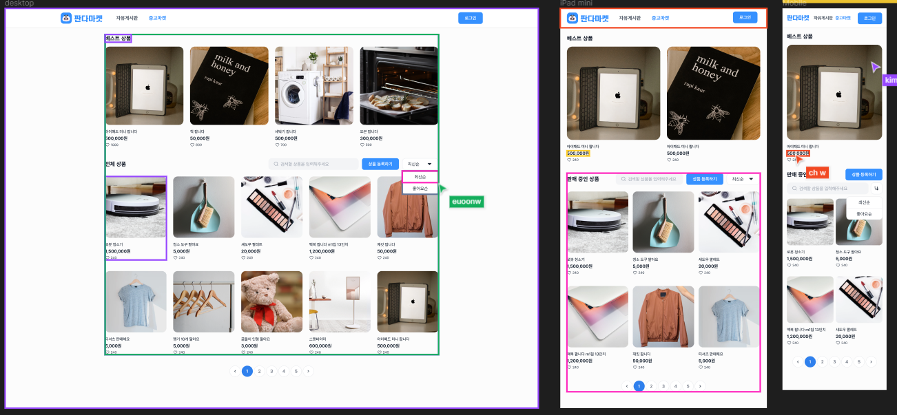

# sprint 5

## 기본 요구사항

React를 사용하여 구현

## 체크리스트 [기본]

중고마켓 페이지 주소는 “/items” 입니다.

페이지 주소가 “/items” 일때 상단네비게이션바의 '중고마켓' 버튼의 색상은 “3692FF”입니다.

상단 네비게이션 바는 이전 미션에서 구현한 랜딩 페이지와 동일한 스타일로 만들어 주세요.

상품 데이터 정보는 https://panda-market-api.vercel.app/docs/#/ 에 명세된 GET 메소드 “/products” 를 사용해주세요.

'상품 등록하기' 버튼을 누르면 “/additem” 로 이동합니다. ( 빈 페이지 )

전체 상품에서 드롭 다운으로 “최신 순” 또는 “좋아요 순”을 선택해서 정렬을 할 수 있습니다.

중고마켓 반응형

베스트 상품
Desktop : 4개 보이기
Tablet : 2개 보이기
Mobile : 1개 보이기
전체 상품
Desktop : 12개 보이기
Tablet : 6개 보이기
Mobile : 4개 보이기

## 체크리스트 [심화]

페이지 네이션 기능을 구현합니다.

## 개인적으로 적용해보고 싶은거

FSD architecture