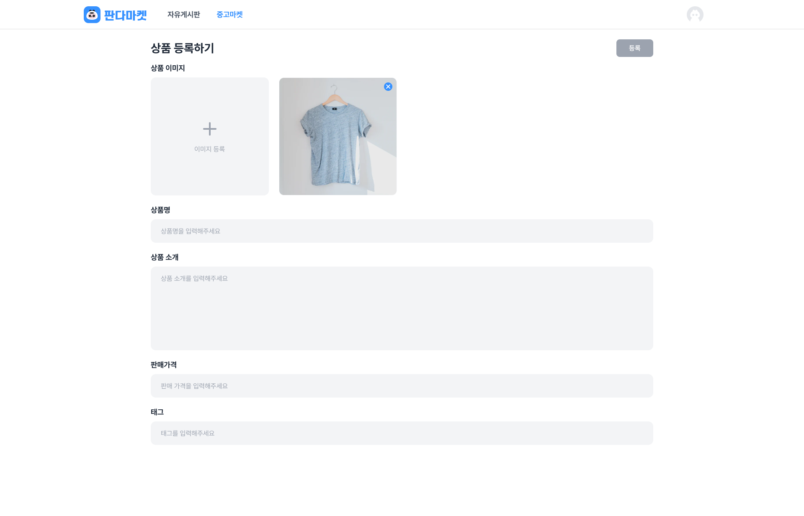

# sprint 6

 
 

## 체크리스트 [기본]
### 상품 등록

상품 등록 페이지 주소는 “/additem” 입니다.

페이지 주소가 “/additem” 일때 상단네비게이션바의 '중고마켓' 버튼의 색상은 “3692FF”입니다.

상품 이미지는 최대 한개 업로드가 가능합니다.

각 input의 placeholder 값을 정확히 입력해주세요.

이미지를 제외하고 input 에 모든 값을 입력하면 ‘등록' 버튼이 활성화 됩니다.

API를 통한 상품 등록은 추후 미션에서 적용합니다.

## 체크리스트 [심화]
### 상품 등록

이미지 안의 X 버튼을 누르면 이미지가 삭제됩니다.

추가된 태그 안의 X 버튼을 누르면 해당 태그는 삭제됩니다.

## 피드백

1. 금액 관련 ,을 넣는 유틸 함수를 만들거나 Intl 객체 이용

## 개인적으로 하는 작업

1. Custom Hook으로 fetch관련 로직 분리
2. UI에는 UI만 다루게 하고 비즈니스 로직은 Hook으로 관리하기