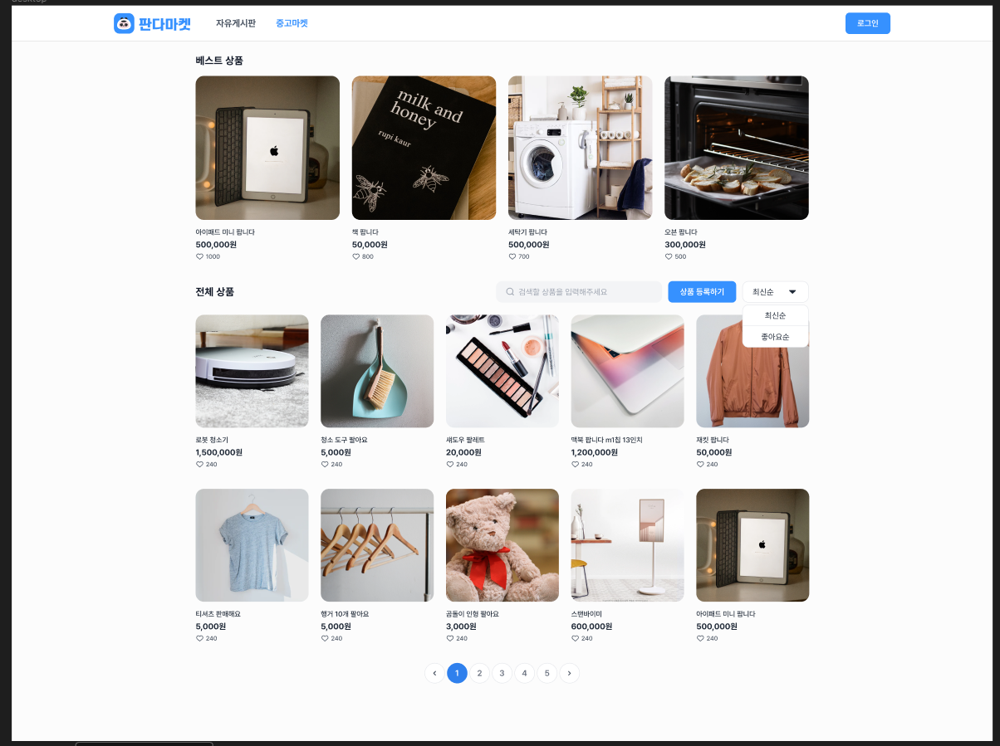
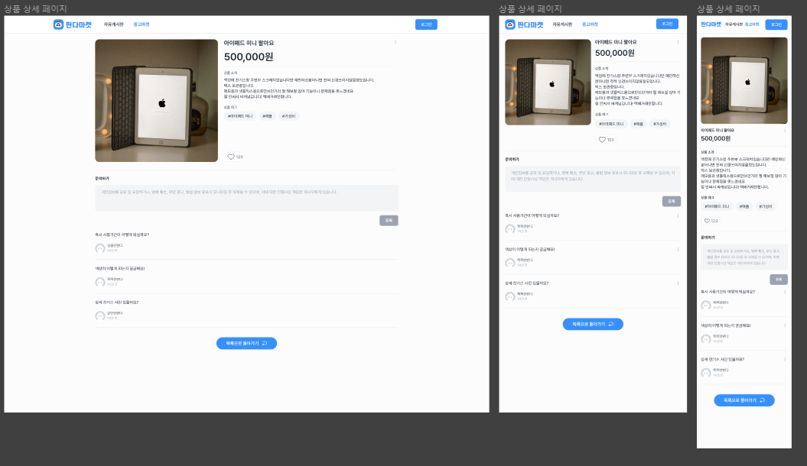
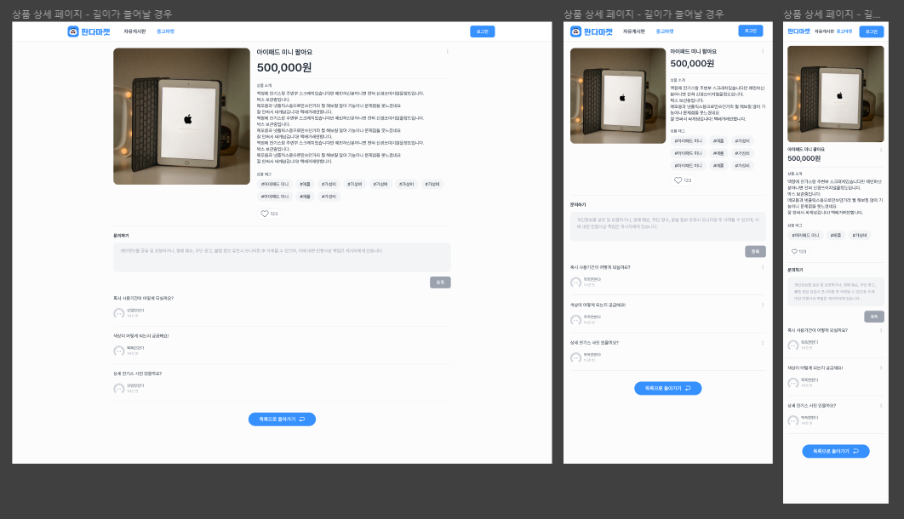
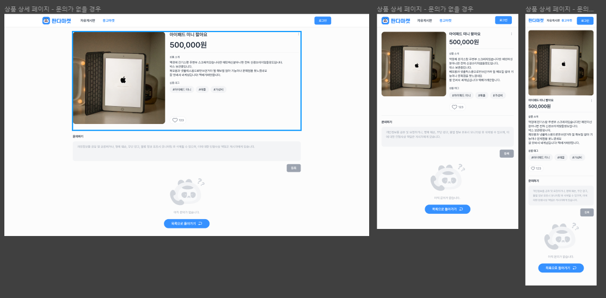

# sprint 7

## 체크리스트 [기본]

## 상품 상세

"/products/{productId}" GET method 활용

상품 상세 페이지 주소는 “/items/{productId}” 입니다.

response 로 받은 아래의 데이터로 화면을 구현합니다.

=>  favoriteCount : 하트 개수

=>  images : 상품 이미지

=>  tags : 상품태그

=>  name : 상품 이름

=>  description : 상품 설명

목록으로 돌아가기 버튼을 클릭하면 중고마켓 페이지 주소인 “/items” 으로 이동합니다

## 상품 문의 댓글

"/products/{productId}/comments" GET method 활용

문의하기에 내용을 입력하면 등록 버튼의 색상은 “3692FF”로 변합니다.

response 로 받은 아래의 데이터로 화면을 구현합니다.

=>  image : 작성자 이미지

=>  nickname : 작성자 닉네임

=>  content : 작성자가 남긴 문구

=>  description : 상품 설명

=>  updatedAt : 문의글 마지막 업데이트 시간

## 백엔드 API 주소

https://panda-market-api.vercel.app/docs/#/

## 피드백
## 개인적으로 적용해볼 것

Styled Component