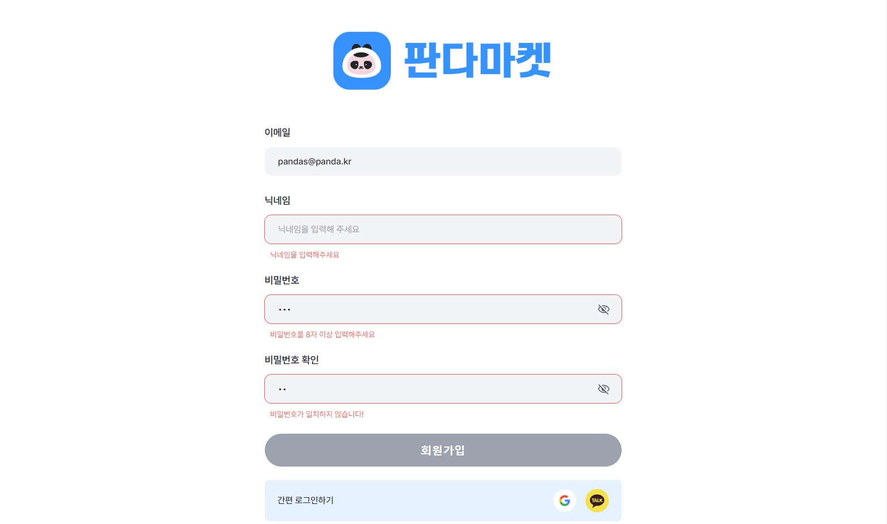

# 코드잇 스프린트 6기 프로젝트

## 목차

- [코드잇 스프린트 6기 프로젝트](#코드잇-스프린트-6기-프로젝트)
  - [목차](#목차)
  - [개요](#개요)
    - [페이지 스크린샷](#페이지-스크린샷)
    - [링크](#링크)
  - [내작업](#내작업)
    - [사용한것](#사용한것)
    - [배운점](#배운점)
  - [작성자](#작성자)

## 개요

### 페이지 스크린샷

- 코드잇 스프린트에서 진행한 네 번째 스프린트 미션
  - 로그인 및 회원가입 페이지 - 유효성 검사

### 링크

- 사용한 폰트
  - [Pretendard](https://github.com/orioncactus/pretendard)

## 내작업

### 사용한것

- javaScript
  - if 문
  - for 문
  - querySelector
  - 삼항연산자
  - spread 문법

### 배운점

- querySelectorAll을 통해 반환한 NodeList를 다루는 방법
- 로그인 버튼 활성화 알고리즘에서 힘들었었는데, 현재 작성한 코드가 마음에 들지 않으니 다른 방법을 더 찾아봐야겠다.

## 작성자

**최수형(SOOHYEONG CHOI)**

- [github](https://github.com/User850413)
- [velog](https://velog.io/@user850413)
